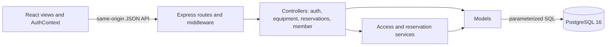

# Collaboratory MVC implementation

This branch integrates the team's React frontend with Express 5 and PostgreSQL 16. It is a working architectural slice, not completion of the entire sponsor MVP. It does not depend on Figma MCP or public GCCIS DNS.

## Architecture



- **View:** `frontend/src/pages`, components, typed API contracts and request hooks. No SQL, database credentials, or trusted roles live in the browser.
- **Controller:** `backend/src/controllers` converts validated HTTP input into service/model calls and response DTOs. Routes declare authentication and mutation protections.
- **Model:** `backend/src/models` owns persistence and query logic. `backend/src/db.ts` owns connections and transactions.
- **Services:** `AccessService` and `ReservationService` coordinate business rules and multi-model transactions. Concurrent bookings lock equipment before checking availability; a database exclusion constraint also rejects overlapping writes.

## Implemented slice

- Registration and password verification; persistent database sessions restored after refresh.
- Server-derived member/staff roles. Typing `admin` in an email or changing local storage never grants privileges.
- Equipment catalog loaded from PostgreSQL, including current eligibility explanations.
- Create, list and cancel your own equipment reservations. Changes persist after reload and application restart.
- Membership/day-pass, certification, waiver and equipment-state checks at booking time.
- Current waiver versions, explicit agreement and persisted signature timestamp.
- Certification records, profile-name/phone updates, membership/day-pass access status.
- Web check-in validates access and current waivers, then records the user, timestamp and location.

## Intentionally not complete

- Class registration and admin charts remain **clearly labeled design previews**. Sample enrollment/revenue is not live operational data.
- Studio leasing, billing/payments, plan purchases, email notifications, password reset, staff CRUD, physical readers, and production operational tooling are not implemented.
- Registration creates an account, **not** a paid membership. Staff administration for granting access is still needed; the isolated demo has seeded access.
- Figma MCP is a separate outstanding integration. Designs originate from the team's exported mockups.

## Data compatibility and rules

`database/migrations/001_mvc.sql` is additive. It preserves existing identifiers, adds sequence defaults, session storage, equipment display fields, waiver activation flags, indexes, and overlap protection. The runner is transactional, serializes migrations, and records immutable checksums.

The team schema uses timestamp-without-time-zone columns. This application writes and reads those timestamps explicitly as **UTC**. Day-pass validity is evaluated by calendar day in `APP_TIME_ZONE` (default `America/New_York`). Browser reservation inputs and displayed times use the user's local timezone, which is displayed beside the inputs. Intervals are half-open: a booking may start exactly when another ends.

Current assumptions to review with the sponsor:

- Active membership or a valid day pass must cover the entire reservation. Maximum duration is 24 hours (UI options: 1, 2, 3, 5 hours).
- Equipment status `available` permits reservations. Other status values deny booking. Status values used by the application are lower-case.
- An equipment certification must remain current through the reservation end.
- If equipment requires waivers, all current required policies must be signed. Check-in always requires those policies. Latest currently-effective version per policy name is selected; a new version requires new agreement.
- Equipment prices are informational; **no payment or invoice is created**.
- Web check-in is self-reported; it does not prove physical presence or control a door.
- The seeded waiver text is a **development fixture**, not the sponsor's legal agreement.

Before migrating a populated database, take a backup and reconcile existing status names and timestamp semantics. Existing duplicate case-insensitive emails, duplicate signed waivers, invalid reservation windows, or overlapping active reservations cause the migration to fail and roll back. Do not delete or rewrite records automatically to make it pass. Legacy plaintext seed passwords are not accepted by the new login endpoint. No migration has been applied to the existing team services as part of this branch's demo.

## API

All responses use `{ "data": ... }`, except logout (204). Errors use `{ "error": { "code": ..., "message": ... } }`.

- `GET /api/health`, `GET /api/config`
- `POST /api/auth/register`, `/api/auth/login`; `GET /api/auth/session`; `POST /api/auth/logout`
- `GET /api/equipment`
- `GET /api/reservations`; `POST /api/reservations` with equipmentId/startTime/endTime; `POST /api/reservations/:id/cancel`
- `GET /api/me/overview`, `/api/me/certifications`, `/api/me/waivers`
- `PATCH /api/me/profile`; `POST /api/me/waivers/:id/sign` with accepted=true; `POST /api/me/check-ins` with location

Authentication uses an opaque HttpOnly, SameSite=Lax cookie; only its hash is stored in PostgreSQL. Mutations require JSON, permitted Origin, and session-bound CSRF verification after login. Session lifetime is 12 hours, or seven days with Remember me. API responses are not cached. Account status and roles are fetched from the database on each protected request. Scrypt hashes replace the prototype's arbitrary-email login.

`ENABLE_DEMO_LOGIN=true` adds an isolated-development shortcut. It is off by default and rejected when `NODE_ENV=production`. The demo Compose file is deliberately not a production configuration.

## Development startup

Requirements: Docker/Compose, or Node 22.18+ plus an isolated PostgreSQL 16 server. Node 22 is used by the container build.

From the repository root:

```sh
docker compose -f compose.mvc.yml up --build -d
```

Open **http://localhost:8081**. Choose **Member demo**, reserve the 3D Printer for a future time within the next 30 days, then reload the page. Cancel the booking, review/sign the sample waiver and check in from Home. Admin demo gives a staff-role session, but its analytics page remains a labeled preview.

The Compose project is `arbor-mvc`; its database and volume are separate from the migrated dev/staging/production stack. Only loopback ports 8081 (app) and 25432 (database) are published. Development-only trust authentication is limited to this synthetic-data instance; do not expose these ports or use this Compose configuration with real data. Repeated startup preserves its database. `docker compose -f compose.mvc.yml down` stops the demo without deleting its data volume.

For hot reload, start only the database service and then:

```sh
npm ci --prefix backend
npm ci --prefix frontend
PGHOST=127.0.0.1 PGPORT=25432 PGUSER=arbor_mvc PGDATABASE=arbor_mvc_dev npm run setup:demo --prefix backend
PGHOST=127.0.0.1 PGPORT=25432 PGUSER=arbor_mvc PGDATABASE=arbor_mvc_dev ENABLE_DEMO_LOGIN=true npm run dev --prefix backend
```

In another terminal, `npm run dev --prefix frontend`, then open http://localhost:5173. Vite proxies `/api` to the API on 8080. Use a real credential store/deployment environment for production; do not copy development authentication settings.

## Production path (not deployed by this work)

Build the image, supply the database connection through the deployment's protected configuration, set `NODE_ENV=production`, `APP_ORIGIN` to the HTTPS origin and `APP_TIME_ZONE`. Run the additive migration explicitly against a verified backup/reconciled schema, then start the app. Secure cookies require HTTPS. Keep the database private and the demo endpoint disabled. Do not use `setup:demo` or the destructive legacy DDL on an existing deployment. The image listens on 8080 for the assigned GCCIS forwarding path; the isolated review demo does not occupy that port on the VM.

## Verification

```sh
npm run check --prefix backend
npm run check --prefix frontend
PGHOST=127.0.0.1 PGPORT=25432 PGUSER=arbor_mvc PGDATABASE=arbor_mvc_dev npm run test:integration --prefix backend
PGHOST=127.0.0.1 PGPORT=25432 PGUSER=arbor_mvc PGDATABASE=arbor_mvc_dev npm run test:integration --prefix frontend
```

Integration suites create fresh, uniquely named `_mvc_test` databases, then drop only those databases on completion. They never reset an existing database. The PostgreSQL test user needs permission to create databases and the `btree_gist` extension.

Backend integration tests cover registration/session recovery, profile persistence, logout, authorization/CSRF/Origin failures, reservation reload and ownership, concurrent conflict rejection, adjacent intervals, direct-SQL overlap protection, access eligibility, waiver agreement, check-in logging, day-pass boundaries and migration rerun preservation. The frontend integration test drives real React components in jsdom through Express HTTP handlers into real PostgreSQL, including a complete remount to verify session/booking persistence. It is **not browser visual QA**.

Primary implementation references: [Express 5 routing](https://expressjs.com/en/guide/migrating-5/), [node-postgres transactions](https://node-postgres.com/features/transactions), [PostgreSQL range constraints](https://www.postgresql.org/docs/16/rangetypes.html).
