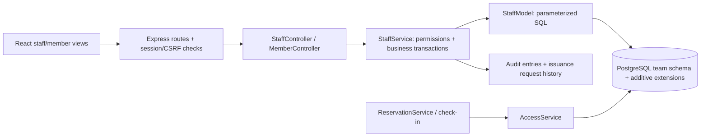

# Collaboratory — primary MVP handoff

Start here for the membership/access implementation. The packaged `BUILD-INFO.txt` identifies the exact source commit. This extends the earlier MVC foundation; it is not a claim that every mockup, secondary feature, or sponsor decision is finished.

## What is now connected

- **Staff workspace → Members:** search registered accounts; update names/phone; grant, suspend, revoke or restore facility access; issue memberships/day passes; review check-ins, payments and audit history.
- **Plans:** create/edit membership tiers and day-pass offers; specify USD price, monthly duration and benefits; archive/re-enable offers. Issued records retain their original plan snapshot.
- **Payment history:** record externally received payments, pending amounts, waived amounts, voids and full external refunds. Staff can filter by member. Members can view only their own records.
- **Policies:** administrators can publish full-text, dated waiver versions with a source/approval reference. Members must sign the current required versions. Earlier signatures are retained.
- **Change log:** actor, target, time, reason and before/after values for staff mutations.
- **Member Membership page:** current/scheduled/expired/suspended/revoked entitlement history, plan benefits, available offers and personal payment records.
- Existing account login, profile updates, equipment reservations/cancellation, waiver signing and web check-in remain connected.

## Start the isolated demo

From the extracted source/repository root:

```sh
docker compose -f compose.mvc.yml up --build -d
```

Open `http://localhost:8081`. **Admin demo** opens the Staff workspace. **Member demo** opens the member view. The demo identities and policy text are synthetic; no shared password is required. The demo login endpoints are forbidden in production mode.

Use **Create account** on the login page for a fresh member without preloaded access. This is the clearest way to demonstrate staff-issued membership. Account registration is not membership purchase.

The existing Mac-to-VM demo uses a loopback SSH forward. At the final handoff readback the temporary relay timed out; the localhost demo is not guaranteed reachable until that route reconnects. That localhost link is not reachable from teammates' machines; they should run the source locally or use their own authorized VM tunnel.

## Suggested end-to-end walkthrough

1. Register a new member account. Note its email and then sign out.
2. Enter **Admin demo → Plans**. Create a monthly plan with price and benefits; supply a reason.
3. In **Members**, search for the new account and select it. Choose the plan under **Issue membership or day pass**.
4. Choose a start time and an initial payment record. Choose *Pending* unless a payment was actually received externally. *Paid externally* requires a method; *Waived* records a zero amount. Add a reason and issue access.
5. Reload the page and reopen the member. The membership, original plan details, payment and audit entries remain.
6. Sign in as the member. Review **Membership**, sign the sample policy under **Certifications & Waivers**, and check in from Home.
7. Return to staff. Suspend facility access with a reason. The member can still sign in and read history but new check-ins and reservations are rejected by the server.
8. Restore facility access. Valid dated entitlement and signed waivers are still required. Restoring the global access flag alone does not create either.
9. To demonstrate renewal, choose **Prepare renewal** on a membership. Its exact end time is copied into the issuance form; choose an active plan and issue the next period.
10. Try repricing/archiving a plan. Old issued benefits/prices remain intact, while archived plans disappear from new issuance choices.

## Permission model

| Operation | Member | Staff | Administrator |
| --- | --- | --- | --- |
| Read own access/payment history | Yes | Yes | Yes |
| Read staff member/payment/change lists | No | Yes | Yes |
| Manage plans and ordinary members | No | Yes | Yes |
| Manage another staff account | No | No | Yes |
| Grant/change staff/admin roles | No | No | Yes |
| Publish/retire policy versions | No | No | Yes |
| Change own staff role/facility-access flag | No | No | No |

“Admin” in the React session's coarse `role` means access to the staff workspace; the server also checks the actual `roles` array before administrator-only operations. Roles and account status are re-read from PostgreSQL, including for existing sessions. Public registration cannot create a staff role. An administrator promotes an existing registered account; this does not send invitations or email.

Authentication account status (`user.status`) and facility access (`user.accessstatus`) are intentionally distinct. These new controls change facility access, not the account's password/login lifecycle. Legacy inactive accounts still need an explicit operational account-reactivation process; changing the facility flag does not activate them.

## Business rules and limitations

### Plans and dated access

- Membership durations are **1–120 calendar months**, calculated in UTC from the exact supplied start instant. January 31 clamps to the target month's final day. Day passes cover one calendar day in `APP_TIME_ZONE`, default `America/New_York`.
- Membership starts are inclusive. Check-in at the exact end instant is expired. Reservations may end exactly at that boundary, and a renewal may start there.
- Expiration/scheduled status is computed from dates on reads and access checks. There is no cron job that must run before expiration takes effect.
- Active/suspended overlapping membership periods and duplicate active/suspended passes on one date are rejected. Revoked entitlements cannot be restored; issue a new one. Global facility revocation can be explicitly restored by authorized staff.
- Plan changes affect future issuance. History retains snapshots of the offered price, benefits, duration and name. Legacy records without a snapshot are labeled using available legacy catalog data; their original historical price cannot be reconstructed automatically.
- Automatic recurring billing/renewal is **not implemented**. Renewal is staff-issued and dated. Dates, prices, benefits and refund policies remain sponsor decisions.
- Staff-issued access is explicit and can exist with a pending payment record. Payment status is not automatically an access gate. Confirm this operating policy with the sponsor before production.
- Suspension/revocation does not silently cancel existing reservations, erase history or initiate refunds. It blocks new bookings/check-ins. Any handling of existing reservations needs a separate sponsor-approved policy.

### Payment records — not a payment processor

- Amounts are validated decimal strings with two decimal places; PostgreSQL stores `NUMERIC(10,2)`. This version assumes **USD**.
- A payment record and its membership/pass are created in one database transaction. The amount comes from the selected plan, not a client-supplied charge amount.
- Allowed recorded transitions: `pending → paid | void | waived`; `paid → refunded`. Waived, void and refunded records are terminal. A waiver changes the recorded amount to zero; the issued-plan snapshot retains the offered price.
- A refund action records that an external refund occurred. It does not execute a refund or calculate one. Partial refunds, chargebacks, invoices, tax, card storage and online checkout are outside this version.
- Legacy payment states are visible but unknown states are not silently converted into the new workflow.

### Policies and identity

- The full-text publishing workflow is implemented, but the repository still contains **sample waiver text, not a sponsor-approved legal document**. Do not label it as approved.
- Administrators must provide a source/approval reference when publishing. The software stores that reference; it cannot verify legal approval.
- Current required policy selection uses the latest active, already-effective version for each policy name. New effective versions require a fresh agreement. Retiring a newer version can make an older active version current; retire the appropriate prior versions deliberately. Retiring every required policy blocks check-in.
- Web check-in uses the authenticated member's unique database ID and logs user/time/location. It is self-reported, not proof of physical presence, a scanned QR reader or door-control integration.
- Equipment certification and reservation assumptions from [MVC.md](MVC.md) still need sponsor confirmation.

## Implementation map



| Concern | Where to look |
| --- | --- |
| Routes and staff gate | `backend/src/routes.ts`, `middleware/auth.ts` |
| Input validation and exact prices/dates | `backend/src/staffDomain.ts` |
| Staff permissions, transactions, state transitions | `backend/src/services/StaffService.ts` |
| SQL and record projections | `backend/src/models/StaffModel.ts` |
| Facility access enforcement | `backend/src/services/AccessService.ts` |
| Membership/day-pass and waiver eligibility | `backend/src/models/EligibilityModel.ts` |
| Staff workspace and its sections | `frontend/src/pages/AdminDashboardPage.tsx`, `Staff*.tsx` |
| Member-owned history | `frontend/src/pages/MembershipPage.tsx` |
| Shared accessible forms/record lists | `frontend/src/components/Management.tsx` |
| Versioned database changes | `database/migrations/002_primary_mvp.sql` |
| Server and full React integration tests | `backend/test/integration/primary.test.ts`, `frontend/test/integration/staff-flow.test.tsx` |

## API reference

All endpoints are under `/api`. Responses use `{data: ...}`; failures use `{error:{code,message}}`. Staff writes require the existing session cookie, CSRF header, permitted origin, JSON and a human-readable reason. Membership `startsAt` accepts an ISO timestamp with timezone and up to three fractional-second digits (milliseconds); day-pass `validDate` uses `YYYY-MM-DD`. Never put session values into shared notes.

| Method/path | Behavior |
| --- | --- |
| `GET /plans` | Active offers for a signed-in member |
| `GET /me/memberships` | Own latest 100 memberships and 100 passes |
| `GET /me/payments?offset=0` | Own paginated payment records; supplied user IDs do not change ownership |
| `GET /admin/users?search=...&offset=0` | Staff search; 50 records/page |
| `GET /admin/users/:id` | Profile, recent entitlements/payments/audits/check-ins |
| `PATCH /admin/users/:id/profile` | Names/phone; current `revision` required |
| `POST /admin/users/:id/access` | Facility status; current `revision` required |
| `POST /admin/users/:id/role` | Administrator-only role update; current `revision` |
| `POST /admin/users/:id/entitlements` | Issue plan with UUIDv4 `requestId`, membership `startsAt` or pass `validDate`, payment record details and reason |
| `POST /admin/users/:id/entitlements/:kind/:entitlementId/status` | Change owned membership/day-pass status with revision |
| `GET/POST /admin/plans` | Read/create plans |
| `PATCH /admin/plans/:id` | Edit/archive with revision; kind cannot change |
| `GET /admin/payments?userId=...&offset=0` | Paginated recorded payment history |
| `POST /admin/payments/:id/status` | Controlled recorded transition with revision/method/reference/reason |
| `GET /admin/audit?userId=...&offset=0` | Paginated change history |
| `GET/POST /admin/policies` | Read / administrator-only publish |
| `POST /admin/policies/:id/retire` | Administrator-only retirement with reason |

Paged collections return `{items,nextOffset}`. The UI provides paging for global lists; member detail shows the most recent records and points to those lists for more.

### Concurrency and retry behavior

- Staff mutations use a transaction-level advisory lock, then recheck/lock the acting account and target user. This gives one lock order for role changes and access changes. It is intentionally simple for the project scale; it serializes staff writes and should be revisited for substantially higher write volume.
- Every edit carries the displayed row's `revision`. A stale edit returns `409 STALE_RECORD`, not a silent overwrite. Reload before trying again.
- Issuance uses a UUIDv4 request ID and canonical-input fingerprint. The exact same actor/request/body returns the prior committed result without another membership or payment. Reusing an ID with different details returns `409 REQUEST_ID_REUSED`.
- The React issuance form retains its request ID for an unchanged in-tab retry. After a full page refresh following an uncertain result, inspect member/payment history first. Overlap/duplicate checks are additional protection, not a substitute for that review.
- Check-in and reservation creation lock/read the user while checking access. Staff updates serialize against that user lock. Reservation overlap still has the earlier PostgreSQL exclusion constraint.
- Audit rows are written in the same transaction as changes. The API exposes no audit update/delete operation, but a database administrator can still alter database contents; this is not a tamper-evident ledger.

## Database changes and migration precautions

Migration 002 extends the existing schema instead of replacing tables. It adds plan/access/revision metadata, issued snapshots, payment recording metadata, policy text/source fields, `app_staff_audit`, and `app_issuance_request`. No destructive legacy DDL is run against existing databases.

The migration runner records SHA-256 checksums and is transactional. Do not edit an applied migration; add a later numbered file. Re-running migrations skips matching applied files. Duplicate legacy policy `(name,version)` pairs prevent the new unique index from applying and roll back the migration; reconcile them explicitly rather than deleting records to force it through.

Existing user IDs, memberships, payment history and signatures are preserved. The corrected demo seeder no longer replenishes a demo user's expired/revoked membership, restores a removed demo admin role, or recreates renamed/archived sample offers on restart. New demo fixtures are development-only and guarded by database naming and environment checks.

Before any future migration of the actual team database: back up, inspect legacy status names, password formats, date semantics, duplicate emails/policies/waivers and reservation overlaps. This branch has **not** been applied to that original data. A code rollback does not undo migration 002 or later business changes; database restoration is an explicit separate operation, not an automatic startup action.

### This deployment and rollback checkpoint

- Isolated VM source: `/home/student/arbor-mvc`; app loopback port 8081, isolated database loopback port 25432.
- Pre-primary checkpoint: `/home/student/arbor-mvc-pre-primary-vFdV8Dzq/` with `database.dump`, `source.tar.gz`, `counts-before.json`, `restore-list.txt`, and `SHA256SUMS`.
- Previous runtime image retained as `arbor-mvc:pre-primary-20260908`. Do not overwrite that tag while treating it as the rollback checkpoint.
- The dump was actually restored into a disposable database and baseline counts checked. See the verification record for the result.
- Before rollback, stop new writes and preserve a fresh copy of current data. A pre-upgrade restore would discard later business changes, including the newly added membership/payment/audit records. Restore into a separately named database and inspect it before switching the app; never restore over the original team database as part of this demo procedure.
- Public DNS, the temporary SSH relay and authorized RLES console access are operationally separate from these application migrations.

## Verification and troubleshooting

See [PRIMARY-VERIFICATION.md](PRIMARY-VERIFICATION.md) for actual results and [IMPLEMENTATION-LOG.md](IMPLEMENTATION-LOG.md) for work/fix history.

```sh
npm ci --prefix backend
npm ci --prefix frontend
npm run check --prefix backend
npm run check --prefix frontend
PGHOST=127.0.0.1 PGPORT=25432 PGUSER=arbor_mvc PGDATABASE=arbor_mvc_dev npm run test:integration --prefix backend
PGHOST=127.0.0.1 PGPORT=25432 PGUSER=arbor_mvc PGDATABASE=arbor_mvc_dev npm run test:integration --prefix frontend
```

These are the isolated synthetic demo's non-secret connection settings. Tests create uniquely named temporary databases and remove only those databases. Do not point this procedure at production. The `verify` Docker build target includes dependencies and source for running the same checks near the database.

- `ECONNREFUSED` on local 25432: start the isolated database or restore your SSH forward; it is not evidence that stored data vanished.
- `STAFF_REQUIRED` / `ADMIN_REQUIRED`: the server's actual role does not permit the operation; a UI/local-storage edit will not grant it.
- `STALE_RECORD`: reload, review the new state, then submit deliberately.
- `MEMBERSHIP_OVERLAP` / `PASS_EXISTS`: inspect existing dated access; do not repeatedly create new requests.
- `ACCESS_BLOCKED`: facility access is held; payment changes alone do not restore it.
- `MEMBERSHIP_REQUIRED`: check dates/status and membership/pass validity, independently of the global access flag.
- `WAIVERS_NOT_CONFIGURED` / `WAIVER_REQUIRED`: publish the required policy or obtain the current agreement. Do not bypass the check.
- `INVALID_PAYMENT_TRANSITION`: the recorded state cannot be reopened/changed in that way; preserve history and document the intended correction.

## Remaining work and review artifacts

- Obtain and verify sponsor-authorized policy text, plans/prices, staff permissions and operating rules. Configuration support is not sponsor sign-off.
- Classes, studio leasing, integrated payments, automated reminders, analytics, hardware readers/door control, password recovery and production operations remain outside this implementation. Analytics and classes remain labeled previews.
- Figma MCP is still separate and unconnected; existing designs came from the team's exported mockups.
- [REQUIREMENTS-TRACEABILITY.md](REQUIREMENTS-TRACEABILITY.md) maps the supplied brief to evidence and gaps. It must be reconciled with the team's final feature list and assigned human owners before submission.
- Gate Review evidence/slides do not replace the sponsor Quad Chart and sponsor presentation. No course submission, email or GitHub push is performed by this implementation.
